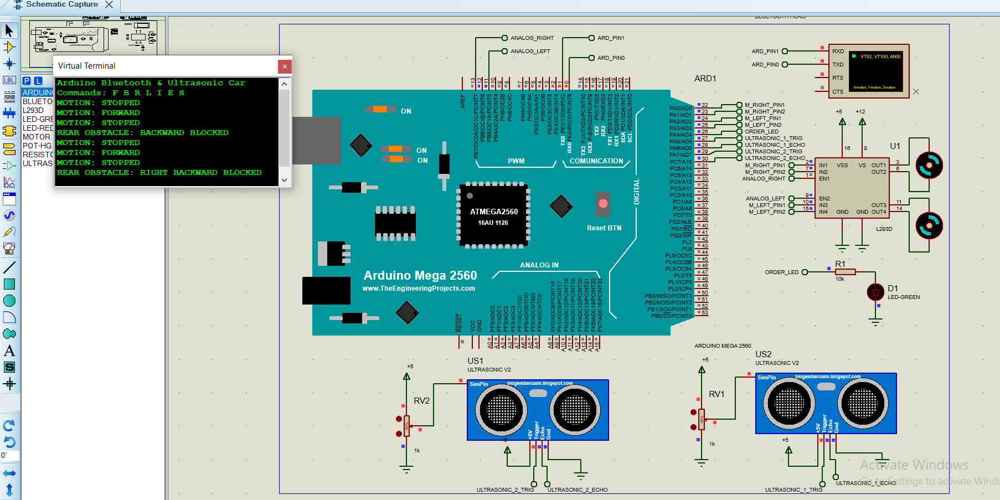

# Arduino Bluetooth & Ultrasonic Robotic Car

An Arduino Mega based robotic car featuring **Bluetooth/Serial control, dual ultrasonic obstacle protection, independent motor control, and Proteus simulation**.

The system allows directional control of the vehicle while continuously monitoring the front and rear areas to prevent movement toward detected obstacles.

---

## Project Overview

This project implements a remotely controlled robotic car using an **Arduino Mega 2560** and an **L293D motor driver**.

Movement commands are received through Serial communication, allowing the same control concept to be used with a Bluetooth serial module such as the HC-05.

Two ultrasonic sensors provide independent front and rear obstacle protection.

If an obstacle is detected within the configured safety distance, movement toward that obstacle is automatically blocked or stopped.

---

## Proteus Simulation



The complete system was tested using Proteus simulation.

The Virtual Terminal demonstrates successful command processing and safety behavior, including normal forward movement and blocked reverse movement when a rear obstacle is detected.

---

## Main Features

- Arduino Mega 2560 based control
- Bluetooth / Serial command interface
- Dual DC motor control
- L293D motor driver
- Independent PWM motor speed control
- Front ultrasonic obstacle detection
- Rear ultrasonic obstacle detection
- Automatic directional safety stop
- Forward and backward movement
- Forward steering
- Reverse steering
- Motion status LED
- Proteus simulation and validation

---

## Control Commands

| Command | Vehicle Action |
|---|---|
| `F` | Forward |
| `B` | Backward |
| `R` | Right Forward |
| `L` | Left Forward |
| `I` | Right Backward |
| `E` | Left Backward |
| `S` | Stop |

Commands can be sent through the Serial interface or through a Bluetooth serial connection.

---

## Obstacle Protection Logic

The vehicle uses two ultrasonic sensors:

**Front Sensor**
- Monitors the area in front of the vehicle.
- Forward movement is blocked when an obstacle is detected inside the safety distance.
- Forward steering commands are also blocked when the path is unsafe.

**Rear Sensor**
- Monitors the area behind the vehicle.
- Reverse movement is blocked when an obstacle is detected inside the safety distance.
- Reverse steering commands are also blocked when the rear path is unsafe.

The configured obstacle threshold is:

```cpp
const float OBSTACLE_DISTANCE_CM = 10.0;
```

If an obstacle appears while the vehicle is already moving toward it, the system automatically stops the motors.

---

## Hardware Components

- Arduino Mega 2560
- L293D motor driver
- 2 × DC motors
- 2 × Ultrasonic sensors
- Bluetooth serial interface / HC-05 concept
- LED indicator
- Resistor
- Power supply
- Connecting circuitry

---

## Pin Configuration

| Function | Arduino Mega Pin |
|---|---:|
| Motor A IN1 | 22 |
| Motor A IN2 | 23 |
| Motor B IN1 | 24 |
| Motor B IN2 | 25 |
| Motion LED | 26 |
| Front Ultrasonic TRIG | 27 |
| Front Ultrasonic ECHO | 28 |
| Rear Ultrasonic TRIG | 29 |
| Rear Ultrasonic ECHO | 30 |
| Right Motor PWM | 12 |
| Left Motor PWM | 11 |

---

## Motor Control

The two DC motors are controlled through the L293D motor driver.

PWM outputs allow independent control of the right and left motor speeds.

The project uses two primary speed levels:

```cpp
const uint8_t NORMAL_SPEED = 128;
const uint8_t TURN_SPEED   = 64;
```

Different PWM values between the two motors are used to generate directional steering.

---

## Safety Behavior

The control software continuously checks both ultrasonic sensors.

For example:

```text
Command: F
Front path clear
→ Vehicle moves forward

Command: B
Rear obstacle detected
→ Reverse movement blocked

Vehicle moving forward
Front obstacle appears
→ Automatic safety stop
```

This behavior was verified in the Proteus simulation through the Virtual Terminal output.

---

## Software Structure

The Arduino program is organized into separate functions for:

- Ultrasonic distance measurement
- Motor direction control
- Vehicle movement
- Steering
- Motor PWM output
- Serial command processing
- Obstacle protection
- Automatic safety stopping

This keeps the control logic modular and easier to understand or extend.

---

## Project Structure

```text
arduino-bluetooth-ultrasonic-car/
│
├── assets/
│   └── proteus_car_simulation.png
│
├── proteus/
│   └── ROBOTIC CAR.pdsprj
│
├── src/
│   └── Arduino_Bluetooth_Ultrasonic_Car.ino
│
└── README.md
```

---

## Running the Project

### Arduino

Open:

```text
src/Arduino_Bluetooth_Ultrasonic_Car.ino
```

using the Arduino IDE.

Select the appropriate Arduino Mega board and serial port, then compile and upload the program.

### Proteus

Open:

```text
proteus/ROBOTIC CAR.pdsprj
```

in Proteus.

Load the compiled Arduino firmware into the simulated Arduino Mega if required, start the simulation, and use the Virtual Terminal to send the supported control commands.

---

## Possible Future Improvements

- Physical HC-05 Bluetooth implementation
- Smartphone control interface
- Adjustable speed commands
- Additional obstacle sensors
- Autonomous driving mode
- Improved steering control
- Battery monitoring
- Encoder-based motor feedback

---

## Skills Demonstrated

- Arduino programming
- Embedded systems fundamentals
- Serial communication
- Bluetooth control concepts
- Ultrasonic sensing
- DC motor control
- PWM speed control
- Motor driver interfacing
- Obstacle detection
- Safety logic
- Proteus simulation
- Robotic system integration

---

## Tools & Technologies

- **Arduino Mega 2560**
- **Arduino IDE**
- **C / C++**
- **Proteus**
- **L293D**
- **Ultrasonic Sensors**
- **Serial Communication**
